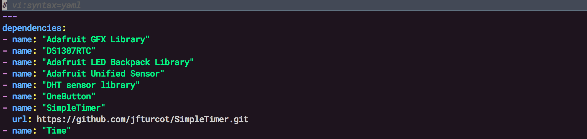
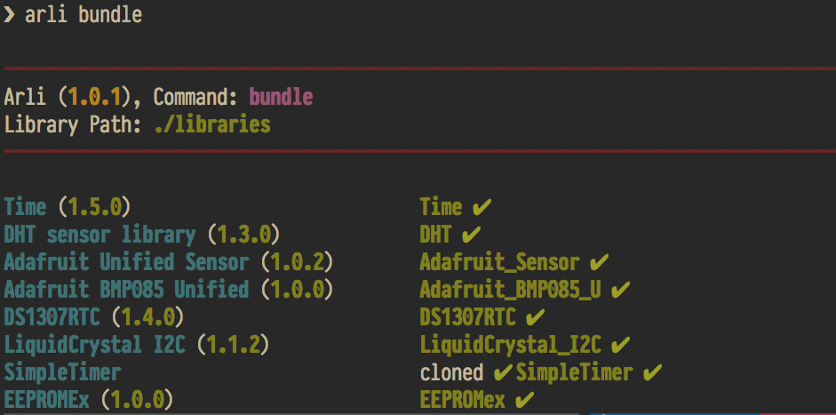
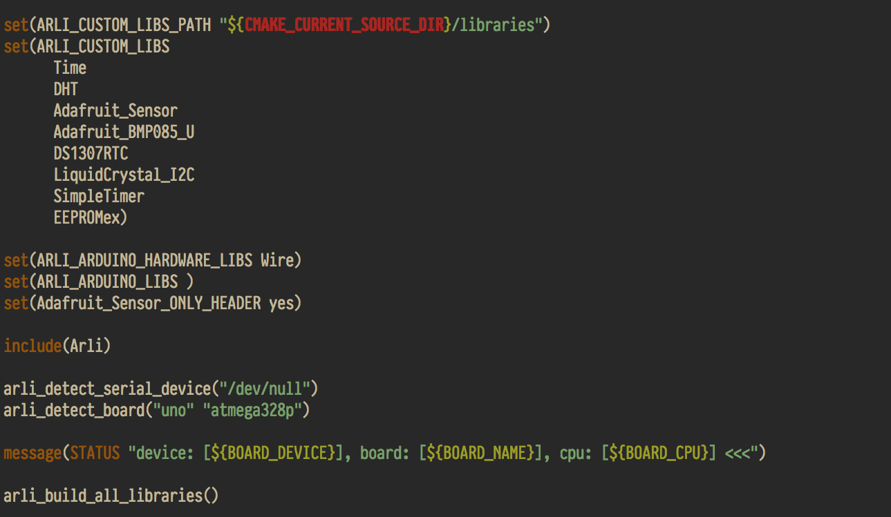
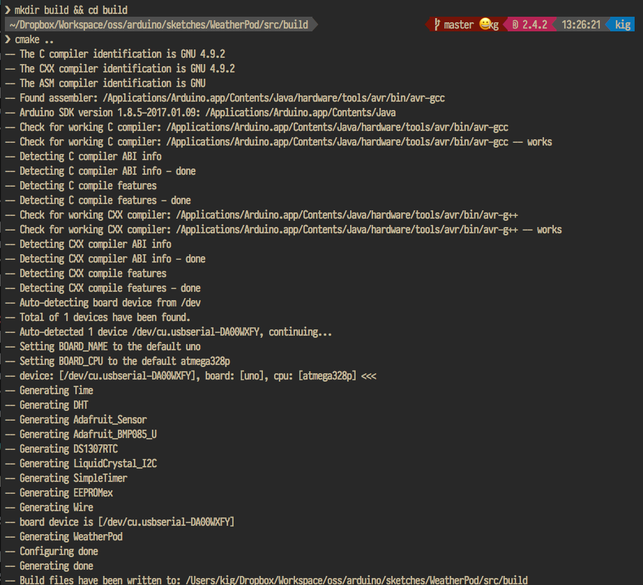
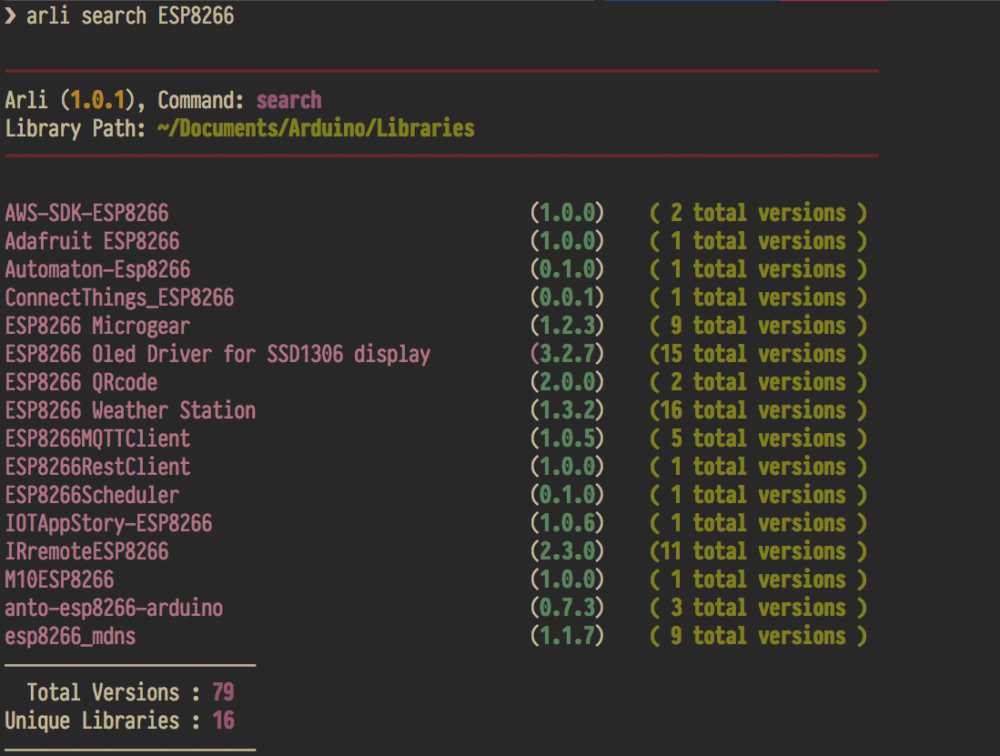

[](https://badge.fury.io/rb/arli)
[](https://travis-ci.org/kigster/arli)
[](https://codeclimate.com/github/kigster/arli/maintainability)
[](https://codeclimate.com/github/kigster/arli/test_coverage)

Please visit Gitter to discuss this project.

[](https://gitter.im/arduino-cmake-arli/) 

# Arli — The Missing Arduino Library Manager

**Arli** is a simple and very easy to use the command-line tool, which offers several vital features to aid in Arduino project development, especially for larger projects with many depenencies and external libraries.

Arli can:

 * automatically **find, download and install** of any number of third-party Arduino library dependencies, while performing a [library folder name resolution](#folder-detection)

 * **maintain a consistent set of libraries** for a given project using a YAML-formatted `Arlifile`.

 * **generate a new project skeleton** that uses [`arduino-cmake`](https://github.com/arduino-cmake/arduino-cmake) as the build environment, which builds and uploads your firmware "out of the box".

 * **search for Arduino libraries** in the official public [database](http://downloads.arduino.cc/libraries/library_index.json.gz) maintained by Arduino using any library attribute by exact match, or regular expression, substring, and more.

### Who is Arli For?

_Arli is ideally suited for C/C++ programmers who have some basic knowledge of CMake, and who want to build larger-than-trivial projects on Arduino platform.  Arli promotes use and reuse of libraries, which help take advantage of the Object Oriented Design Patterns, decoupling your code into reusable libraries._ 

Having said that, Arli is also helpful for projects that do NOT use CMake.  It can be used purely as a library manager, or GitHub repo downloader. 

### Why not the Arduino IDE? 

Arduino IDE is not meant for professional engineers — it's a fantastic educational tool for students. And while it lacks basic features of C/C++ development it succeeds in making Arduino programming accessible to young kids and students.

### Why not Platform.IO?

[PlatformIO](http://platformio.org/) is a great "eco-system" that includes not just Arduino, but many other boards, provides integrated library manager, and Atom as the primary IDE. It's a fantastic tool for beginner/intermediate developers, much better than Arduino IDE. 

But it's not without its downsides: to some — PlatformIO feels *too heavy*. It comes with a gazillion additional features you'll never use and it tries to be too much all at once. Perhaps for some people — it can be a feature. But for the author and other members of the Arduino dev community, PlatformIO design goes against the fundamental principals of [Unix Philosophy](https://en.wikipedia.org/wiki/Unix_philosophy), which promotes a minimalist, modular software development delegated to specialized commands that can be all interconnected (think `grep`, `awk`, `sort`, `uniq`). 

### How is Arli Different?

Arli is a fast, small, and pretty specialized command line tool (written in Ruby) that only does **four or five things very well**, and relies on other well-supported projects do their job — in particular, it relies on Arduino SDK, and `arduino-cmake` when it generates new projects.

Arli shines when you need to build a complicated and multi-dependency project using an Arduino compatible board such as [Teensy](https://www.pjrc.com/teensy/), which has 16x more RAM than the Arduino UNO, and therefore allows you to take advantage of many more third-party Arduino libraries at once within a single project.

> A few years ago the author built a complex project called [**Filx Capacitor**](https://github.com/kigster/flix-capacitor), which relied on **ten** external libraries. Managing these dependencies was very time-consuming. Asking someone else to build this project on their system was near impossible. Not just that, but even for the author himself, after taking some time off and returning to the project — it was still difficult to figure out why it was suddenly refusing to build. So many things could have gone wrong. 
>
> This is the problem Arli (together with the very powerful `arduino-cmake` project) attempts to solve. Your project's dependencies can be cleanly defined in a YAML file called `Arlifile`, together with an optional board name and a CPU. Next, you add a bunch of C/C++ files to the folder, update `CMakeLists.txt` file and rebuild the project, upload the firmware, or connect to the serial port. See [arli-cmake](https://github.com/kigster/arli-cmake#manual-builds) for more information. 

### So, How does Arli Do It?

Arli integrates natively with the [arduino-cmake](https://github.com/arduino-cmake/arduino-cmake) project, and provides an automatic generator for new projects, that should compile and upload out of the box.

You can declare library dependencies, and Arli will happily find and install them for you, while the [arli-cmake](https://github.com/kigster/arli-cmake) project (that's a bridge between the two) can be used to compile each external library into a static `.a` object, and link it with your firmware in the end.

## Overview

Arli offers several commands, explained below:

* `arli search [ name | regex | ruby-expression]`  
  [searches](#search-command) for a library by name or any attribute

* `arli install [ name | regex | ruby-expression ]`  
  search, and [install](#install-command) a single library if the search resulted in one and only one match.
    
* `arli bundle [ -f [ yaml | json | cmake | text ]  ] `  
  reads a YAML-formatted `Arlifile`, and [bundles](#bundle-command), i.e., searches, downloads, resolves the appropriate library folder name, and installs all libraries to either a global location, or a custom location specified by a `-l` flag, or in the `Arlifile` itself.
  
  In the CMake mode, generates `Arlifile.cmake` that is included in the main CMake of the project.
    
* `arli generate ProjectName [ -w ~/workspace ]`  
  [generates](#generate-command) a clean brand new C/C++ project in a given folder, that consists of  `Arlifile`, a C++ file, a `CMakeLists.txt` file, and the dependent CMake libraries all included.

## Arlifile and the Bundle Command

This is the cornerstone of this library, and so we discuss this in detail.

Below is the image of a pretty comprehensive version of an `Arlifile`, which should be placed at the top of your project sources. 



The `dependencies` is the key that lists third-party libraries. But you can also define hardware dependencies such as `Wire`, and the BOARD name and the CPU if your project relies on a particular board. 

> One of Arli's design goals was for `Arlifile` to become a central "configuration" file for the project, and go beyond pure dependencies and also contain some additional metadata about the project that makes your code easily portable to another computer.

#### Bundle Command Explained

When you run `arli bundle` in the folder with an `Arlifile`, many things happen. Below is another screenshot of running bundle:



Let's break down what you see in the above screenshot: 

 * Arli reads the list of `dependencies`, and for each library without the `url` field, it performs a search by the library `name` and optionally `version`, and then it prints the found library name in blue. 
 * The `version` that either was specified in the `Arlifile` or is the latest for this particular library is printed next, in green. 
 * Then Arli downloads the library sources either using the URL provided, or the URL attribute of the search result. Note, that **Arli always downloads libraries into a temporary folder first.**. 
 * Arli then scans the files inside each folder, and cleverly determines the *canonical directory name* for each library based on the most appropriate C/C++ header file. 
 * Next, the library is moved to the new canonical name within the temporary folder, and then the canonical folder is moved into the destination library path. 
 * If the destination folder already exists, three possible actions can happen, and are controlled with the `-e` flag:

    * the default action is to simply **overwrite the existing library folder**.
    * by using `-e [ abort | backup ]` you can optionally either abort the installation, or create a backup of the existing folder.

#### Arlifile "Lock" File

Whenever `bundle` command runs using an `Arlifile`, upon completion another file will be found in the same folder: typically `Arlifile.txt`, which contains metadata about libraries installed.

What's powerful is you can change the format of this file:

```
$ arli bundle -f [ yaml | json | cmake ]
```

Will create `Arlifile.yaml` or `Arlifile.cmake` with the set of resolved libraries.

<a name="folder-detection"></a>

### Automatic Folder Name Correction

Arli understands that the folder where the library is installed must be named correctly: in other words, **folder name must match the header file inside of the folder** for the library to be found.

When Arli downloads libraries in ZIP format, they are unpacked into a folder that would not resolve as an Arduino library folder without having to be renamed. Arli provides an algorithm that searches the contents of the folder for the source and header files. The name of the directory is then compared to the files found, and in most cases Arli will automatically **rename the library folder to match the main header file ** 

> For example, 'Adafruit GFX Library' is the proper name of a corresponding library, and it's ZIP archive will unpack into a folder named `Adafruit_GFX_Library-1.4.3`.  Arli will then detect that the header file inside the folder is `Adafruit_GFX.h`. In this case Arli will rename the top-level folder to `Adafruit_GFX`, and make the library valid, and its folder easily found. 

<a name="generate-command"></a>

## Command Generate

This command creates a new project using the template provided by the [`arli-cmake`](https://github.com/kigster/arli-cmake) project.

```bash
$ arli generate MyClock --workspace ~/arduino/sketches
```

This command will create a brand new project under `~/arduino/sketches/MyClock`, and you should be able to build it right away:

```bash
cd ~/arduino/sketches/MyClock
bin/setup 
cd src
rm -rf build && mkdir build && cd build
cmake ..
make
make upload
```

The above steps can also be done via `bin/build src` bash script.

There is an additional `example` folder that shows the complete example that uses external libraries, and builds and compiles using CMake and Arli.

> **IMPORTANT**: Please do not forget to run `bin/setup` script. It downloads `arduino-cmake` dependency, without which the project will not build.

<a name="bundle-command"></a>

## Command Bundle

Use this command to install Arduino libraries defined in the `Arlifile` yaml file.

Below is a pretty comprehensive version, which not only defines external dependencies to be installed (in the `:depenencies` key), but also specifies built-in Arduino libraries, including Hardware libraries such as `Wire`. 

Arlifile can also specify it's own installation path, lock file format (see below), and some additional device parameters.


There are two main categories of libraries you will be installing:

 1. One of the officially registered in the [Arduino official library database](http://downloads.arduino.cc/libraries/library_index.json.gz), which is a giant gzipped JSON file. Arli will download and cache this file locally, and use it to find libraries. 

 2. Using the `:url` field that links to either a remote ZIP file, or a Github Repo.
 
> When using the public database, which at the time of this writing contains 1220 unique libraries, spanning 4019 separate versions. when the remote file's size changes, will Arli automatically detects that by issuing a `HEAD` HTTP request, and after comparing the size to the locally cached version, it might decide to re-download it. 
> 
> Note that this functionality is provided by the "sister" Ruby gem called [`arduino-library`](https://github.com/kigster/arduino-library), which essentially provides most of the underlying library-specific functionality.
 
#### Installing from the Database

You can specify libraries by providing just the `name:` (and posibly `version`) — the name must match exactly a library in the Arduino standard 

You can provide the following fields in the `Arilfile` if you want the library to be found in the Arduino Library database:

 * `name` should be the exact match. Use double quotes if the name contains spaces.
 * `version` can be used together with the `name` to specify a particular version. When `name` is provided without `version`, the latest version is used.
 * `checksum` and `archiveFileName` can be used as they both uniquely identify a library.

#### Installing From a URL

If a library you are using is not in the public database just provide its `name` and the `url` fields. The URL can either be a git URL, or a downloadable ZIP file. Arli will use the `url` field if it's available without trying to search for the library elsewhere.

#### Generated "lock" file — `Arlifile.<format>`

Whenever `bundle` command succeeds, it will create a "lock" file in the same folder where the `Arlifile` file is located.

The purpose of this file is to list in a machine-parseable way the *fully-resolved* installed library folders. 

There are four lock file formats that are supported, and they can be passed in with the `-f format` eg `--format text` flags to the `bundle` command:

 * `text` 
 * `json`
 * `yaml`
 * `cmake`

Each format produces a file `Arlifile.<format>`: YAML and JSON will simply include the complete library info received from the database, while text format includes a *resolved* library folder names, versions, and the download URL —  all comma separated, one per line.

#### CMake Integration

The CMake format is now fully supported, in tandem with `arduino-cmake` project.

Below is the resulting `Arlifile.cmake` after running `arli bundle` on the above mentioned file.



See the `generate` command, which creates a new project with CMake enabled.

If you create `build` folder and run `cmake ..` here is what you'll see:



Just run `make` or `make upload` right after build and upload your firmware.

<a name="install-command"></a>

## Command `install`

Use this command to install a single library by either a name or URL:

Eg:

```bash
❯ arli install 'Adafruit GFX Library' -l ./libs
❯ arli install 'https://github.com/jfturcot/SimpleTimer'
```

<a name="search-command"></a>

## Command `search`

To search Arduino library database, you can use the search command.

You can search in two ways:

 1. simple substrin match of the library name
 2. complex arbitrary attribute match, that supports regular expressions and more.

`arli search AudioZero` does a simple search by name, and would match any library with 'AudioZero' in the name, such as `AudioZeroUpdated`. This search returns three results sorted by the version number:

```bash
❯ arli search AudioZero

--------------------------------------------------------------------------------
Arli (0.8.4), Command: search
Library Path: ~/Documents/Arduino/Libraries
--------------------------------------------------------------------------------

AudioZero                                       (1.1.1)    ( 3 total versions )

———————————————————————
  Total Versions : 3
Unique Libraries : 1
———————————————————————
```

The search argument can also be a ruby-syntaxed expression, that (if you know ruby)  is actually `eval`-ed into the method parameters. Here are a few examples:

You can also use regular expressions, and set maximum number of results printed by the `-m MAX` flag.



#### Search Output Format

Finally, you can change the output format of the search, by passing `-f <format>`, where `format` can be `short` (the default), `long`, `json`, or `yaml`.

For example, here is a how long format looks like:

```
❯ arli search 'name: /adafruit/i'  -f long

Arli (0.8.4), Command: search
Library Path: ~/Documents/Arduino/Libraries
_______________________________________________________________
Name:        Adafruit ADS1X15
Versions:    1.0.0,
Author(s):   Adafruit
Website:     https://github.com/adafruit/Adafruit_ADS1X15
Sentence:    Driver for TI's ADS1015: 12-bit Differential or 
             Single-Ended ADC with PGA and Comparator
_______________________________________________________________
Name:        Adafruit ADXL345
Versions:    1.0.0,
Author(s):   Adafruit
Website:     https://github.com/adafruit/Adafruit_ADXL345
Sentence:    Unified driver for the ADXL345 Accelerometer
.....

```

With `-m LIMIT` flag you can limit number of results. But in our case above we printed all libraries that had the word "adafruit" (case insensitively) in their official name. We could have used `version:`, or `author`, or `website`, or even `url` and `archiveFileName` fields. For complete description of available library attributes, please see the official definition of the [`library.properties`](https://github.com/arduino/Arduino/wiki/Arduino-IDE-1.5:-Library-specification#library-metadata) file.

A detailed description of the complete search functionality is documented in the library that provides it — [arduino-library](https://github.com/kigster/arduino-library#using-search). Arli uses the `arduino-library` gem behind the scenes to search, and lookup libraries.

## Discussion

### More Reasons Why Arli is Needed

Arli is both an *Arduino Library Manager* and a project generator. If you are using Arduino IDE you may be wondering **why is this needed?**

 * Well, for one, Arli can "bundle" libraries not just from the official Arduino database, but also from individual Github URLs. There are thousands of libraries of high quality, that for one reason or another did not make it into the official database.

 * Arduino still haven't come up with a way to automatically document project's dependencies on a set of libraries. I believe the best you've got is having to list libraries in comments, and then install each manually. With Arli you can automate this entire process.

 * [Not everyone likes using Arduino IDE](https://kig.re/2014/08/02/arduino-ide-alternatives.html). So this tool is, perhaps, aimed more at the professional programmers, wanting to build applications that tend to be on a complex side, and rely on multiple third party libraries. Boards like Teensy have a lot more RAM than Arduino UNO and clones, and so it can support much larger projects with dozens of libraries linked in with the firmware.

 * One of Arli's design goals is to provide a bridge between the [arduino-cmake](https://github.com/arduino-cmake/arduino-cmake) project, which provides an alternative build system, and is compatible with numerous IDEs such as [Atom](https://atom.io), [JetBrains CLion](https://www.jetbrains.com/clion/), [Visual Studio Code](https://code.visualstudio.com/), or even [Eclipse](https://eclipse.org).


## Development

After checking out the repo, run `bin/setup` to install dependencies. Then, run `rake spec` to run the tests. You can also run `bin/console` for an interactive prompt that will allow you to experiment.

To install this gem onto your local machine, run `bundle exec rake install`. To release a new version, update the version number in `version.rb`, and then run `bundle exec rake release`, which will create a git tag for the version, push git commits and tags, and push the `.gem` file to [rubygems.org](https://rubygems.org).

## Contributing

Bug reports and pull requests are welcome on GitHub at https://github.com/kigster/arli.

## License

The gem is available as open source under the terms of the [MIT License](http://opensource.org/licenses/MIT).
